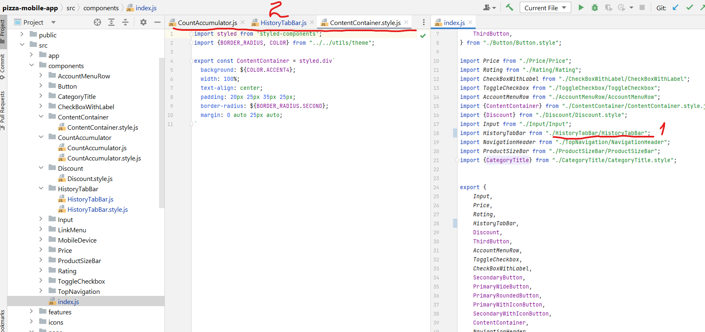

### About project
Web app to order pizza. Mobile only.

[The design](https://www.figma.com/file/UlLz0hGT4UmfWNBnpdJhpD/Pizza-mobile-app)

### Implementation road map 
1. UI implementation.
2. FE, BE, DB works together.
3. CMS for business FE, BE, DB.
4. Business point app FE, BE, DB.
5. Inform restaurant about orders with possibility to change price, menu etc.

We are currently on 1.

### Development convention: 

1. We develop mobile app only. That's why we will have mobile page for desktop, tablet too.
2. Our design is responsible in range 370px - 414px.
   We ordered the design to have good view.
   That's why we want to keep proportions and keep it beautiful on any devices.
3. We have 5 colors for now. If you see that in the design we have colors that
   doesn't exist in palette try to find the closest and inform me (Vladislav) to change it in 
   the design too. To be consistent.

### File naming convention
We don't use index.js or .jsx in folders because
1. Yes we have duplication of folder and file names
2. But we save place in tab names. Let's imagine if it called index.js

