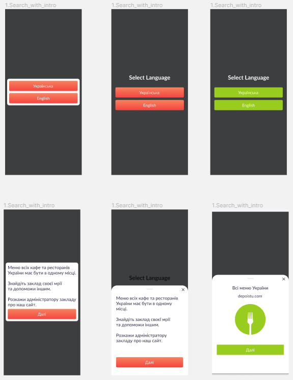
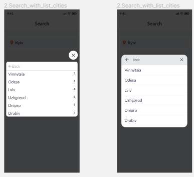
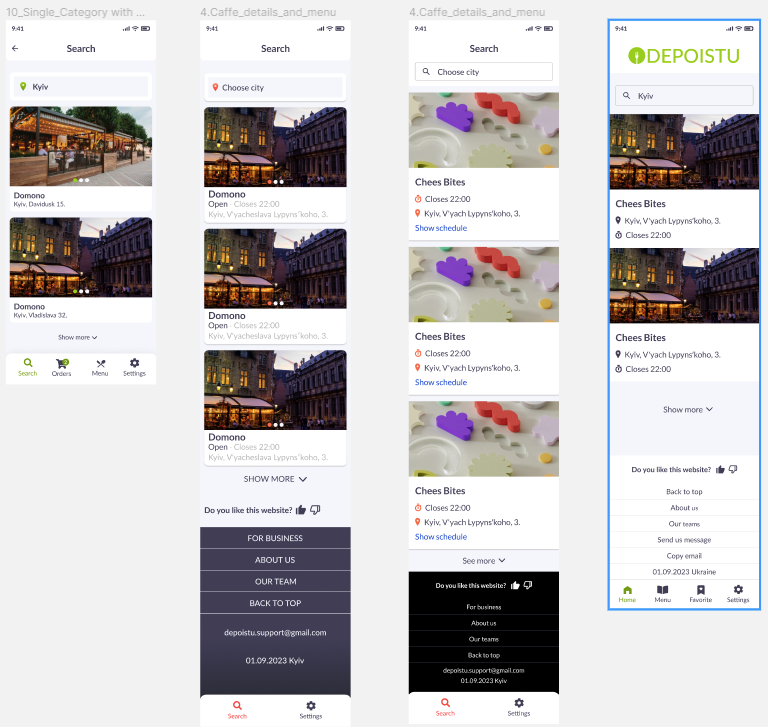
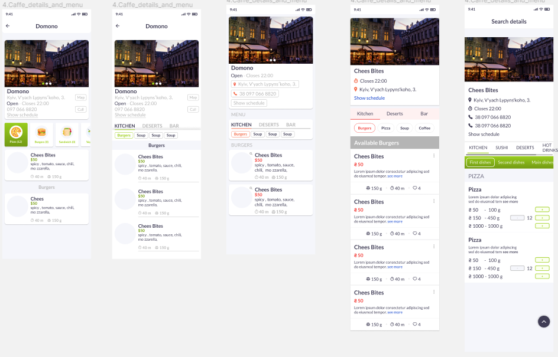
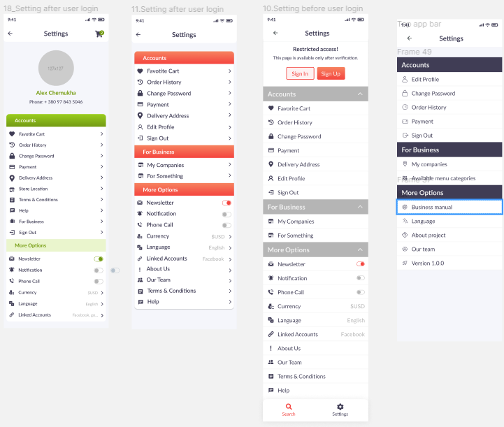
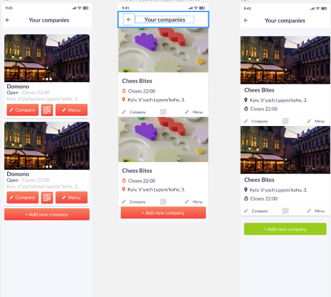
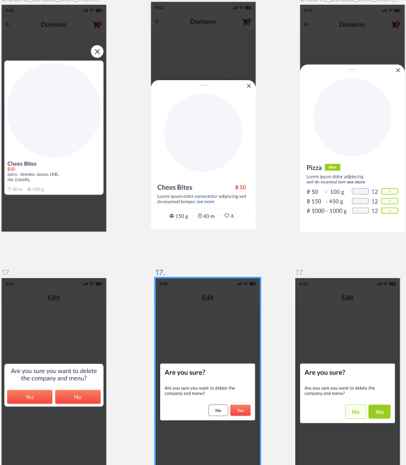
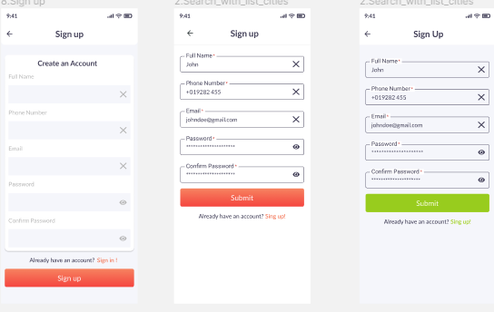
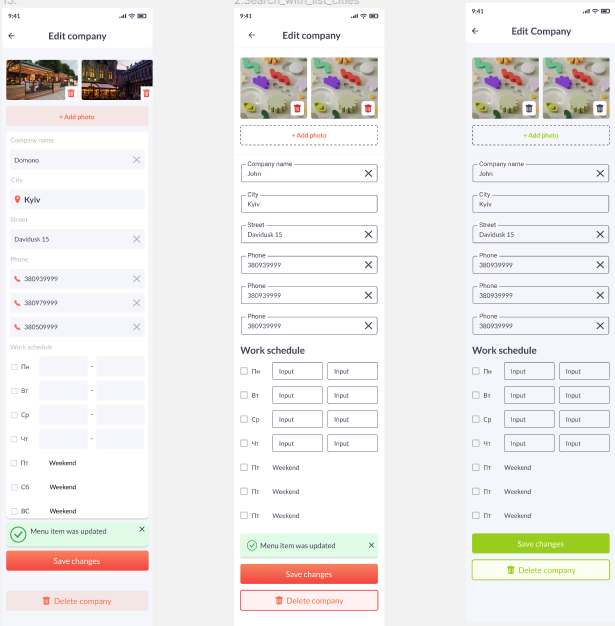
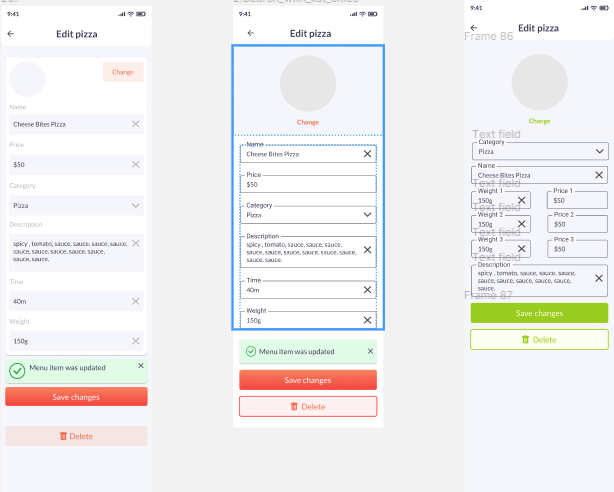

# After one year conclusion.

#### First conclusion:
1. We made minimum 5 websites.
2. It was expensive economy
3. We spent low amount of money but big emount of time, efforts.
4. Each should do  their job.
5. Manager can create only mocks desing should make designer
6. We didn't have business plan
7. We didn't have invetigation of indastry

#### Second conclusion.
As you don't know what type of data you need. How many fields company will have maybe it's better to start without design at all and use html default tag style ? After all stuff will be done we ask designer to do their job.
1. NO BEAUTI ONLY FUNCTIONALITY. FIRST WORK THAN BEAUTY.
2. Minimun validation
3. One language.

### MAIN CONCLUSION

#### Why does it happend ?
1.  The idea to create ecosystem "clients-busines owners" happend after 4 months we started.  First we made website for one company only than we changed direction.
2. We didn't know what data we need.
3. We didn't know what functionality we need.

After all now we know what do we need.

It was learning by doing.
Our power is many try. 
Then more we can try than bigger chance on success.

You should now be proud that you are busy, overwhelmed, tired.
If didn't have time we were not able to make this review and conclusion.
It's very important to take a break and check direction.
Good speed wrong direction no results.
It's more painfully if you have family. 
Then suffer all.
